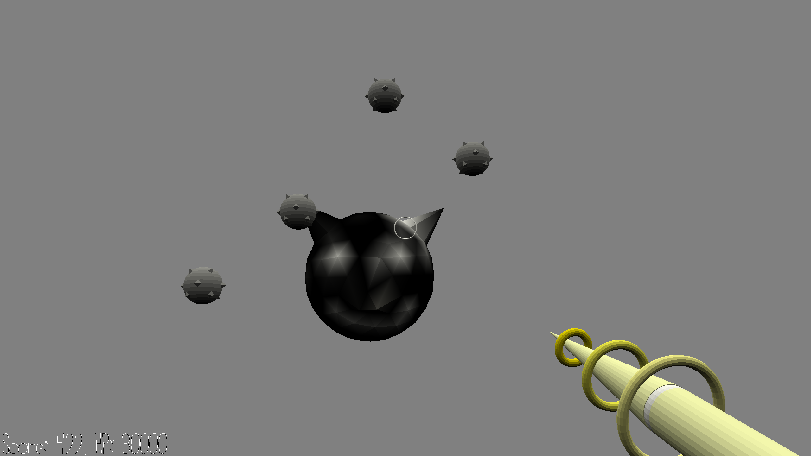

# Alien Bomb Concert 

Author: Sherwin JIN

Design: A rythm game but played as a FPS game

Screen Shot:

How To Play:

Move mouse and shoot the bombs. When a bomb gets shot and explode, a sound of pitch will be played. Try to sync the pitchs with the background music. (Hint, a perfect sync happens when the bomb aligns its center with the bomb alien in the background). You get higher score if you do that better. 
Note: If the is never hit and moves cross the boundary on the right side, it will automatically explode and play its sound.
**Use your own song**: the default song (written by the author of this game) is used for the game. You can replace it with any song you like, as long as you provide an [ABC Notation](https://en.wikipedia.org/wiki/ABC_notation) file, and run the asset pipeline on it by running `bash sound_assets_pipeline.sh [path_to_your_abc_notation_file]`.

Attributions:

This game is based on my game2. All the codes copied from game2 are in the commit with tag `game2`. It also uses the scenes and models of game2.
This game uses an open source python synthesizer called `PySynth`. It is a submodule of the game repository. The tool can convert any "ABC notation" file into a wav music file. Two python files are added to support the sound assets pipeline for this game: `PySynth/abc_to_note_list.py` and `PySynth/note_list_to_assets.py`. Both are based on `PySynth/read_abc.py`. You can think of the first file `abc_to_note_list.py` is not my work since it only has minor changes from `read_abc.py`. For `note_list_to_assets`, the codes after the comment at line 79 `# My own codes start from here` can be considered my work.

This game was built with [NEST](NEST.md).
